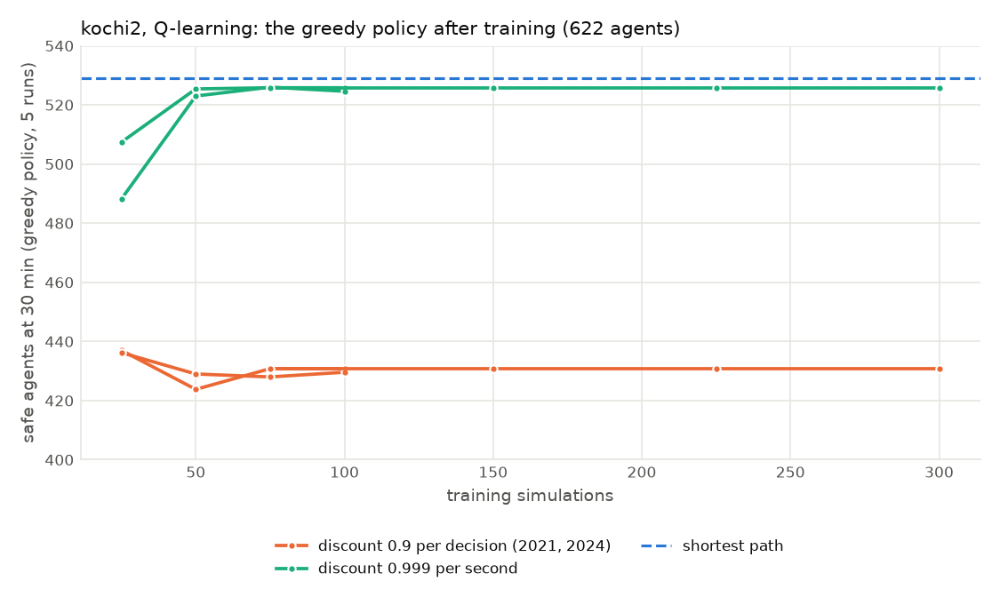
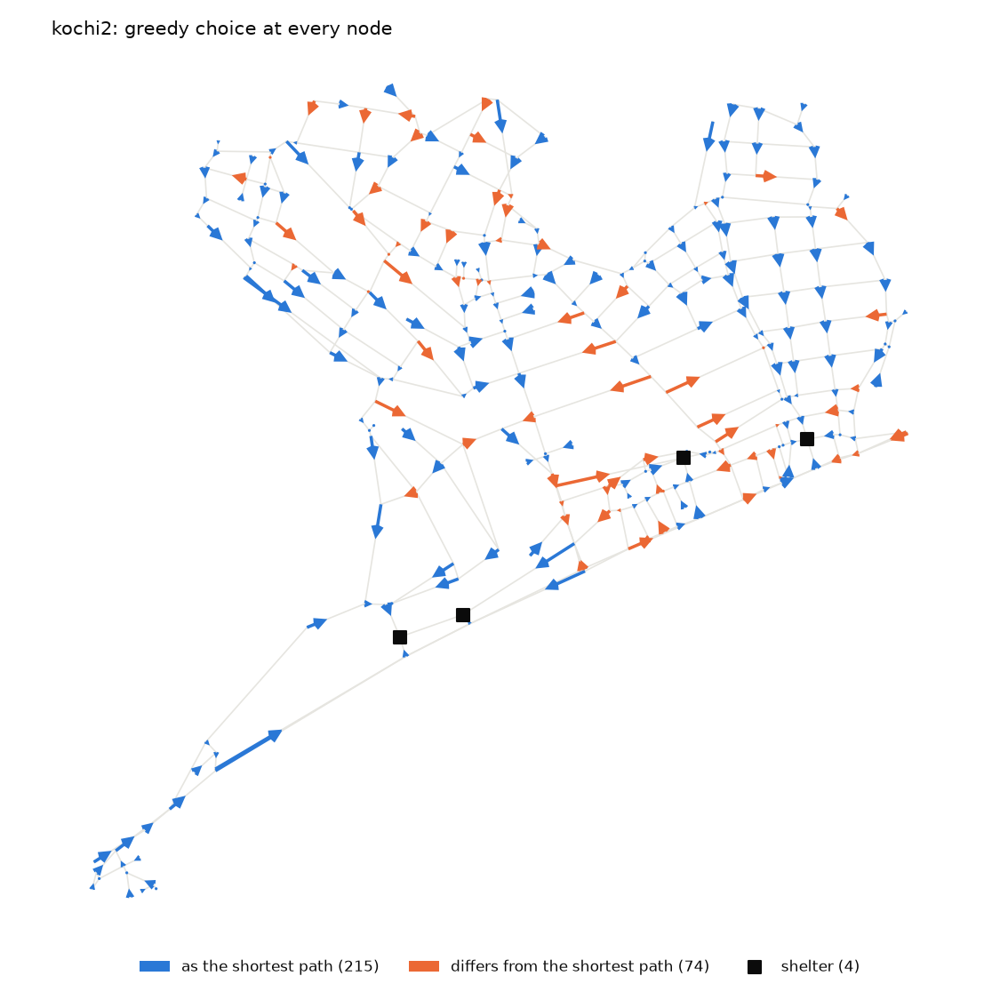
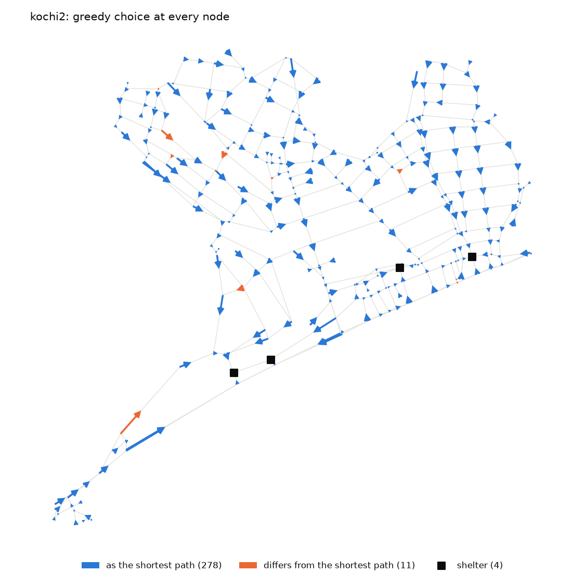
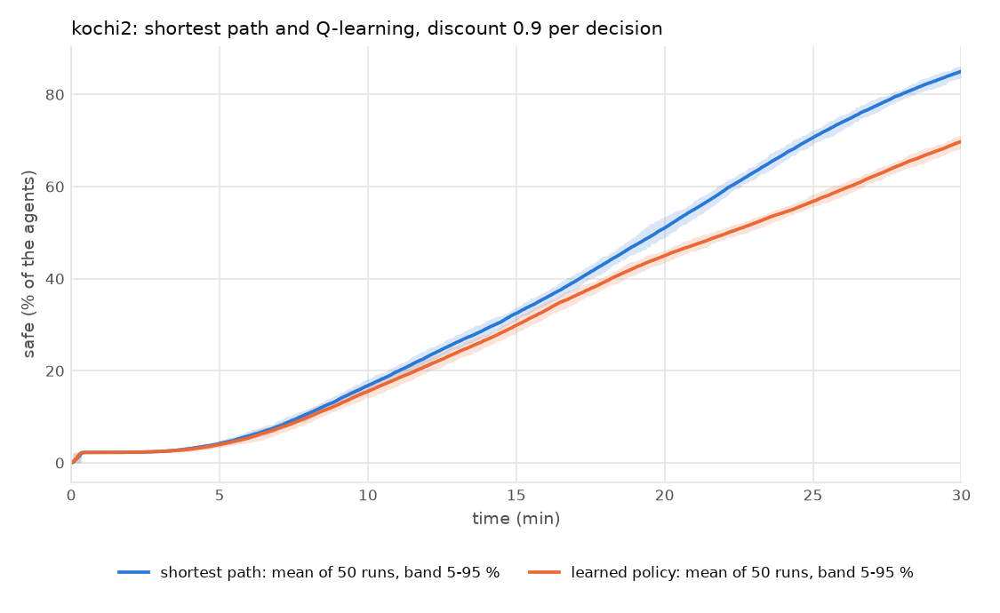
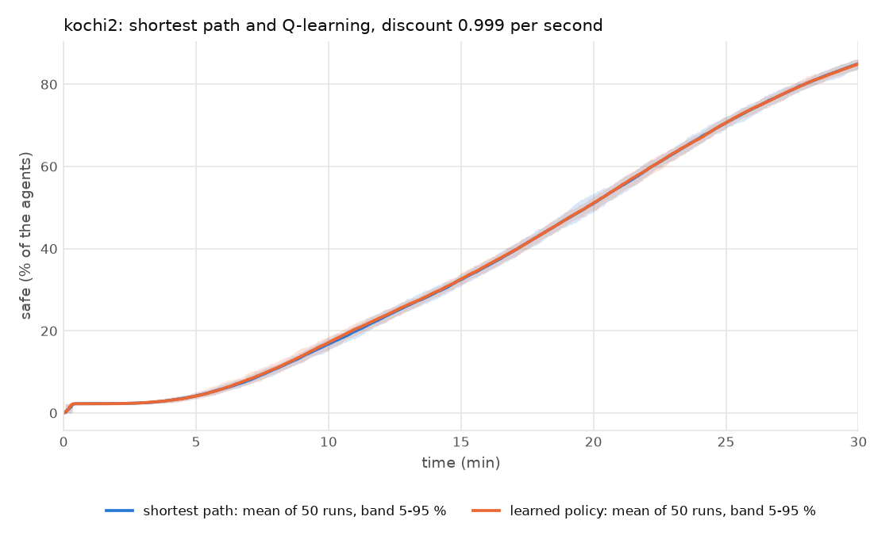

# Step 4 audit: why the learned policies stop at 81 % of the shortest path, and the experiment layer

Two things were done. **4a** found the cause of the plateau that Steps 1 and 2 left open: it is the discount, not the training and
not the algorithm. **4b** built `evacrl.experiment` (repeated shortest-path runs with a convergence rule, training with greedy
checkpoints, policy maps, comparison plots, run manifests, a command line) and checked it against the 1,000 committed runs of the 2024
study. Everything here can be regenerated:

```
git clone https://github.com/erick2307/2024_urushibara ~/2024_Urushibara     # or set URUSHIBARA_DIR to its EVACMODEL3_FocalPoints folder
pip install -e ".[casebuild]"        # scipy for the tests of the statistics; the experiment layer itself needs only numpy and matplotlib
cd docs/audits/step4
python policy_ceiling.py kochi2 20          # 4a  the exact optimum of the learning target, a few minutes
python gamma_learning.py kochi2             # 4a  Q-learning with two discounts, about 40 min on 4 cores
python methods_per_second.py kochi2         # 4a  SARSA and Monte Carlo with the per-second discount, about 10 min on 2 cores
python experiment_layer.py 150 4            # 4b  against the committed runs, about 25 min on 4 cores
sh demo_cli.sh && python figures.py         # 4b  the command line on kochi2, and the figures below
sh frozen_evaluation.sh                     # 4b  the saved policies evaluated frozen and adapting, about 15 min on 4 cores
python density_states.py kochi_area2 10     # 4c  does the state carry information about crowding?
```

## 4a. The plateau is the learning target

Q-learning and SARSA learn `Q(S, A) = E[ sum_k gamma^k (-1 s) dt_k + gamma^n * surviveReward ]`: a reward of -1 per second, a lump sum of
`surviveReward` (1e5) on arriving, and `gamma = 0.9` applied **once per decision**, that is per node passed. Reaching a shelter after
20 nodes is worth 1e5 * 0.9^20 = 12,158, and one node more or less changes that by about 1,200: as much as 1,200 s of walking. So the target
prefers *fewer nodes* to a *shorter walk*, and nodes are not equally far apart.

`policy_ceiling.py` solves the target exactly (value iteration on the network, no learning, no noise), runs the resulting fixed policy in the
simulator like the shortest-path baseline (20 departure-time seeds, mean departure 5 min), and does the same for other discounts. Case
`kochi2` (309 nodes, 622 agents, 4 shelters):

| Policy (the best one of the target) | Walk of an agent, m | Nodes passed | Agents with a longer walk than shortest path | Safe at 30 min | % of shortest path | Last evacuee, s |
|---|---:|---:|---:|---:|---:|---:|
| shortest path (metres) | 990 | 10.3 | 0 % | **529.0** (85.1 %) | 100 % | 2,647 ± 97 |
| discount 0.9 per node (the code of 2021 and 2024) | 1,256 (**+26.8 %**) | 7.9 | 65 % | **426.8** (68.6 %) | **80.7 %** | 3,100 ± 96 |
| 0.99 per node | 1,244 (+25.6 %) | 7.9 | 61 % | 431.4 | 81.6 % | 3,059 ± 111 |
| 0.999 per node | 1,059 (+6.9 %) | 8.6 | 45 % | 502.6 | 95.0 % | 2,673 ± 136 |
| 0.999 per second | 990 (0 %) | 10.3 | 0 % | 529.0 | 100 % | 2,647 ± 97 |
| 0.9999 per second | 990 (0 %) | 10.3 | 0 % | 529.0 | 100 % | 2,647 ± 97 |

**The 81 % of Steps 1 and 2 is the ceiling of the target: a perfect learner of it gets 80.7 %.** SARSA and Q-learning with 100 simulations
had reached 428 and 430. A change of the discount from 0.9 to 0.99 per node does not help (the lump sum is still worth more than the walk
for any realistic number of nodes); a discount per *second*, close to 1, makes the target the time to the shelter.

`gamma_learning.py` confirms it with learning (Q-learning, the study's schedule `1 / (s / N + 1)`, 30 min, a checkpoint every N / 4
simulations evaluated greedily on 5 fixed seeds, the best checkpoint kept; the policy is then followed from the start node of every agent):

| Discount | Simulations | Seed | Safe at 30 min, greedy | % of agents | Walk against shortest path | First choice = shortest path's | Nodes passed |
|---|---:|---:|---:|---:|---:|---:|---:|
| 0.9 per decision | 100 | 0 | 437.0 | 70.3 % | +25.4 % | 72.4 % | 7.9 (vs 10.3) |
| 0.9 per decision | 100 | 1 | 436.2 | 70.1 % | +25.5 % | 72.7 % | 7.9 |
| 0.9 per decision | **300** | 0 | 430.8 | 69.3 % | +25.8 % | 79.6 % | 7.9 |
| 0.999 per second | 100 | 0 | **525.8** | 84.5 % | +0.1 % | 96.9 % | 10.3 |
| 0.999 per second | 100 | 1 | **526.0** | 84.6 % | +0.1 % | 96.4 % | 10.3 |
| 0.999 per second | 300 | 0 | 525.8 | 84.5 % | +0.1 % | 96.9 % | 10.3 |
| *shortest path* | | | 529.0 | 85.1 % | 0 | 100 % | 10.3 |



* With 0.9 per decision the walk is 25 % longer and the policy passes 7.9 nodes where the shortest path passes 10.3, **at 100 and at 300
  simulations alike**: the result is the ceiling of the target (426.8), not a stage of training. Whatever 1,000 or 15,000 simulations do
  to the greedy policy, they cannot take it past the optimum of this target.
* With 0.999 per second Q-learning reaches 99.4 % of the shortest path after 50-75 simulations and stays there; its choices are the
  shortest path's at 97 % of the nodes. `python -m evacrl.experiment policy` draws where they differ (11 of 289 nodes, orange) and
  where the 0.9 policy differs (74 of 289):

| discount 0.9 per decision | discount 0.999 per second |
|---|---|
|  |  |

The evacuation curves of 50 greedy runs of each policy against 50 shortest-path runs (`demo_cli.sh`: 433.9 ± 5.5 and 528.2 ± 4.4 safe
at 30 min against 528.6 ± 5.0):

| discount 0.9 per decision | discount 0.999 per second |
|---|---|
|  |  |

The evaluations above let the agents keep learning on a copy of the state during the run (what the study's calibration does). Run **frozen**
(nothing is learned during the run, the default of `evaluate`; `frozen_evaluation.sh`, 50 runs, the same seeds) the four saved policies give the
same numbers to the decimal, 433.9 ± 5.5 (0.9 per decision, 100 simulations), 429.7 ± 5.2 (300), 528.2 ± 4.4 (0.999 per second, 100) and 528.2 ± 4.4
(300): the values had converged, so adapting during the run changes no choice.

**SARSA and Monte Carlo** with 0.999 per second (`methods_per_second.py`, one seed, 60 simulations, same protocol): SARSA 444, 481, 491
safe at 30 min after 20, 40, 60 simulations (still rising; walk +9.2 % against shortest path); Monte Carlo 342, 398, 370 (noisy; +8.3 %).
Q-learning, which bootstraps from the best action rather than from the exploring one, is the quickest here, as expected, with one seed.

### What 4a does not show

* **One case, with almost no crowding.** On `kochi2` the shortest path *is* (nearly) the optimum of the evacuation time, so a perfect
  learner can hardly do better than equal it; 526 against 529 says the learner finds the optimum, not that learning is useful. The point of a learned policy is
  an area where crowding makes the shortest path slow; that has not been run (`kochi_area4`, 13,502 agents, is the candidate). The target
  with 0.999 per second can in principle trade distance for less crowding; the target with 0.9 per decision cannot do that
  sensibly, because it trades the walk for nodes.
* Two seeds for 100 simulations, one for 300; Q-learning only for the long runs; the discounts 0.99 per node and 0.999 per node were
  solved exactly but not learned. Monte Carlo and SARSA: one seed, 60 simulations.
* The other numbers of the target (reward 1e5, `densityLevel`) were not varied here; 4c below looks at the density code.
* Per-second discounting of 0.999 is one value: 0.9999 is the same policy (table above); lower values (0.99 per second) were not looked at.

## 4b. The experiment layer

`python -m evacrl.experiment` with `sp`, `calibrate`, `evaluate`, `policy` and `compare` ([manual](../../manual.md#experiments)). 89 tests on a
hand-made 6-node case (`tests/test_experiment.py`, which needs only NumPy and Matplotlib); 76 deliberate breakages of the code (a changed index, a swapped
stream, an inverted probability, a missing copy ...) were checked against them: 16 were not caught at first, 14 gaps are closed by new tests, and 2 are
equivalent in practice (a comparison at an exact floating-point tolerance, and going back to the best checkpoint when it is also the latest state).

An **independent review** of the code found these defects, all fixed and each now tested: `--restart-from-best` went back to the best checkpoint
before *every* later episode, so everything learned since was thrown away (now: only after a checkpoint that did not improve, and the stored best is
never trained on in place); `safe_at` and the statistics crashed when a simulation ended before the first departure; zero runs crashed and one run wrote
`NaN` (invalid JSON) into the manifest; `--horizon` later than `--time` was silently reported as "safe at 30 min"; the rule to stop counted runs that
had no value; minutes were truncated to seconds (`--time 2.05` simulated 122 s); `evaluate` accepted a state matrix of another case, and its manifest
did not identify the policy (it now records the SHA-256 of the state file); a negative seed and a case folder given as `.` gave a raw error and the name
`.`. Two things the review pointed out are documented rather than changed: the evaluation of a checkpoint is now **frozen** by default (the study's
calibration, and the audits above, let the agents keep learning on a copy; it makes no difference to the four policies, see 4a), and the study's evacuation
time is the loop second at which the final count is *recorded*, which is one second before `safe_at` would show it (`RunResult` and the manual say so;
the numbers here and in the earlier steps follow the study).

### Against the study's 1,000 committed shortest-path runs (`experiment_layer.py`, `kochi2`, 120 min, mean departure 5 min)

| | runs | Evacuation time, s: mean ± sd (CV) | 5 / 25 / 50 / 75 / 95 % | Safe at 30 min | Ended with agents left |
|---|---:|---|---|---|---:|
| **committed** (2024 engine) | 1,000 | 3,697 ± 1,631 (0.44) | 2,465 / 2,562 / **2,692** / 4,900 / 6,976 | 521.0 ± 16.4 | 433 (43 %) |
| `repeat_shortest_path`, `ModelOptions.kochi2024()` | 150 | 3,790 ± 1,683 (0.44) | 2,466 / 2,580 / **2,692** / 5,354 / 6,954 | 519.7 ± 19.5 | 69 (46 %) |
| `repeat_shortest_path`, default options | 150 | **2,605 ± 120 (0.05)** | 2,457 / 2,506 / 2,582 / 2,679 / 2,836 | 528.0 ± 5.2 | **0** |

* With the options of the 2024 study the new code reproduces the committed distribution: two-sample Kolmogorov-Smirnov p = 0.74
  (evacuation time) and 0.91 (safe at 30 min), Mann-Whitney p = 0.42 and 0.99; the median is the same second, 2,692, the 43 % and 46 %
  of runs with agents left are the far-end freeze of Step 1 (Defect A).
* With the default options (that defect fixed) the distribution is another one (p < 0.001 against the committed): the evacuation time is
  2,605 ± 120 s, no run ends with agents left, and the tail up to the end of the simulation is gone. The committed results should be regenerated
  before they are cited (decision D6 of Step 1; one command: `sp kochi2 --until-converged --time 120`).
* **Seeded reruns are identical** (B): the same base seed gives the same curves of every run in 1 or 4 worker processes and when run
  twice, another seed gives other curves. **The loop is the one of the earlier audits** (C): the same seed gives the same curve, second
  by second, as the loop of `effect_on_results.py`.
* **The convergence rule** (D): the running mean and the relative standard error of the mean after n runs. For the default options the
  evacuation time has CV 0.05, so the standard error is 1.35 % at 20 runs, 0.84 % at 40, 0.48 % at 100, and the rule (under 1 %, and the
  mean moving less than 1 % over the last batch, at least 30 runs) stops at **40 runs** (`sp kochi2 --until-converged`: 2,611 ± 139 s, CV 0.053; the same first 40 seeds as the 150 above); the number safe at 30 min (CV 0.01) is under 0.2 % from 20 runs.
  With the 2024 options the evacuation time has CV 0.44, so 1 % needs about 2,000 runs (150 give 3.6 %): the study's 1,000 runs left it
  at about 1.4 %. That is a property of the tail of the freeze defect, not of the method.
* `sp` warns when runs end with agents still walking: the evacuation time is then the last arrival within the simulated time, not the
  time of the last agent. (A 30-minute shortest-path simulation "converges" to 1,796 s only because it is cut at 1,800 s.)

## 4c. Does the state carry information about crowding? (`density_states.py`)

The state of an agent is its node and the density code (0, 1, 2) of each link around it. On `kochi_area2` (the shipped case, 1,704
agents), 10 Q-learning simulations of 30 min:

| `densityLevel` | Nodes | States | Decisions made in a state with a crowded link |
|---|---:|---:|---:|
| `"link"` (2021 code, the default): whole link, 2 m wide | 297 | **297** | **0.00 %** |
| `"segment"` (2024): worst 2 m segment, real width | 297 | 634 | 2.98 % |

With the 2021 code the state is the node and nothing else: every state is a node (as on `kochi2` in Step 1), so the learner cannot tell a crowded
street from an empty one, and what it learns cannot depend on crowding. The 2024 code makes 634 states from the same nodes but only 3 % of
the decisions are made in a crowded one, even with 1,704 agents. The greedy results after 10 simulations (1,094 and 985 of 1,704) say only that more
states take longer to learn; they are not a comparison of the final policies. A crowded area (`kochi_area4`) was not run. So decision D3 of Step 1
(`densityLevel`, `surviveReward` stay at the 2021 values) still stands without evidence for changing it, and the question that matters
(does a policy that sees crowding beat the shortest path where crowding binds?) is open.

## Decisions for you

| | Decision | Recommendation |
|---|---|---|
| D7 | Discount of the temporal-difference methods: keep 0.9 per decision (what the code always did), or `discounting="second"` with `discount=0.999` | **change**: with the old discount the learner cannot get past 81 % of the shortest path (4a), with the new it reaches 99 %. It also needs `surviveReward` to stay large against the discounted step cost (it does: 1e5 against 1 per second), and SARSA and Monte Carlo want a longer look (60 simulations, one seed). Nothing was changed in the defaults: `--set discounting=second --discount 0.999` does it per run |
| D8 | The 2024 Kochi results (1,000 shortest-path runs per area) are regenerated with the default options before they are cited | yes (decision D6 of Step 1; `python -m evacrl.experiment sp CASE --until-converged --time 120`) |
| D9 | What to run next to show that learning is *useful*: a crowded area (`kochi_area4`, 13,502 agents) with the per-second discount, and a segment-level density code, against the shortest path | yes: it is the question the model exists to answer, and 4a says the first run on `kochi2` could not answer it |
